 

**Modern, scalable web apps · AI-powered systems · automation · developer tools**

 

## 👋 About

My core strength is **turning ideas into working software** — frontend architecture, APIs, databases, authentication, AI integrations, deployment and automation, end to end.

I'm especially interested in using AI to automate repetitive work, improve developer workflows, and turn natural-language ideas into usable software.

> *"I don't just write code. I build systems that solve problems."*

## 🚀 What I Build

| | | |
|---|---|---|
| 🌐 **Full-stack web apps** | 🏢 **SaaS platforms** | 🤖 **AI-powered applications** |
| ⚙️ **Automation systems** | 🔌 **REST APIs & backends** | 🧰 **Developer tools** |
| 📱 **Responsive, modern UIs** | 🗄️ **Database-driven apps** | 🐧 **Linux dev environments** |

## 🧠 Tech Stack

## 🔥 Featured Projects

<table>
<tr>
<td width="50%" valign="top">

### 🤖 TechGuru AI
Transforms natural-language ideas into working websites and applications.

`AI-assisted dev` `SaaS` `Web generation` `Automation` `Full-stack`

</td>
<td width="50%" valign="top">

### 🧠 NanoCoder Engine
An experimental AI coding engine exploring lightweight developer tools in constrained environments.

`AI` `Python` `NLP` `Termux` `Machine learning`

</td>
</tr>
<tr>
<td width="50%" valign="top">

### 📈 RyaBot
An automated trading-system project exploring algorithmic decision-making and real-time data processing.

`Java` `WebSockets` `APIs` `Automation` `Real-time`

</td>
<td width="50%" valign="top">

### 💻 Developer Portfolio
My personal engineering portfolio: projects, experiments and the tech I work with.

`React` `TypeScript` `Vite` `Modern UI`

</td>
</tr>
</table>

## 🧩 How I Think About Software

I care about more than making something *work*.

| Lens | The question I ask |
|---|---|
| 🏗️ **Architecture** | Can the system scale? |
| 🔐 **Security** | What happens when someone attacks it? |
| ⚡ **Performance** | Where are the bottlenecks? |
| 🎯 **UX** | Can a real person actually use it? |
| 🧹 **Maintainability** | Will I understand this code in six months? |
| 🤖 **Automation** | What should the machine handle instead of the human? |
| 🛡️ **Reliability** | What happens when something fails? |

Good engineering comes from questioning assumptions *before* writing code.

## 🌱 Currently Exploring

<b>Click to collapse</b>

 

- 🤖 AI-powered software development, LLM applications and agentic workflows
- 🟦 Advanced TypeScript
- 🐍 Python backend architecture: FastAPI & Django
- 📦 Scalable SaaS architecture
- ⚙️ Developer automation
- 🐧 Linux systems
- ☁️ Cloud deployment
- 🌍 Open-source development

## 🎯 Philosophy

### *Learn deeply. Build relentlessly. Question everything.*

Technology changes constantly. The ability to learn, adapt, debug and build is what matters.

## 🤝 Let's Connect

Open to developers, designers, founders, AI builders, open-source contributors and anyone solving interesting problems.

⭐ Star a repo · 👀 Follow my work · 🤝 Collaborate

*If you're building something ambitious, let's build it.*

 

<b>Built with curiosity, code, and a Linux terminal. 🇰🇪</b>

